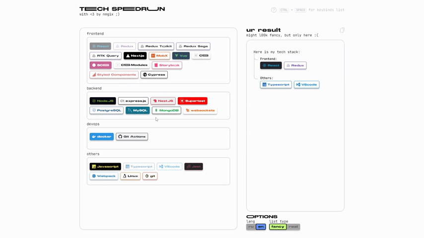
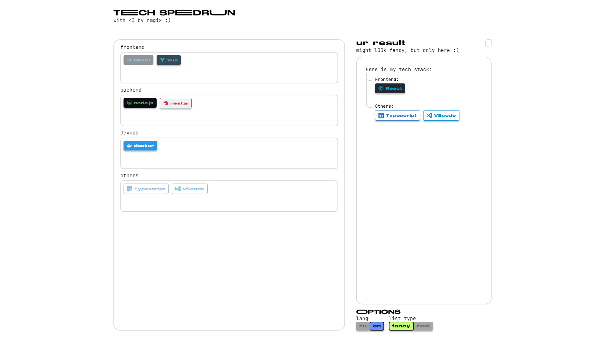
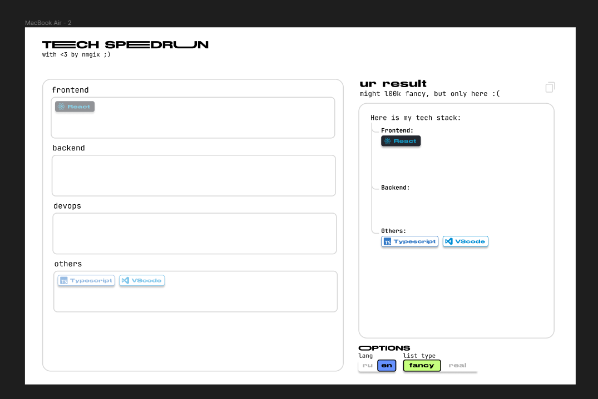
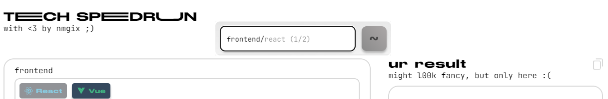
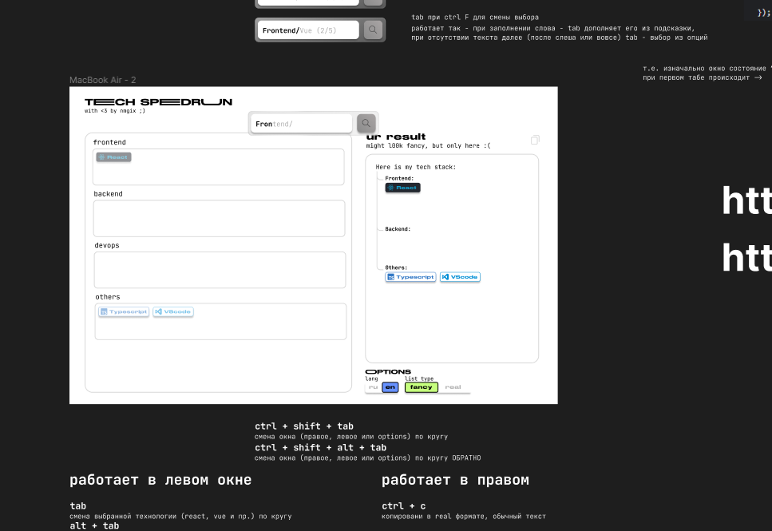

## Tech Speedrun
Небольшое приложения для быстрого набора tech стака в текст

Чтобы добавить свой язык надо: добавить язык в public.languages-characteristics.json (тип LanguageCharacteristic в помощь) -> добавить язык в категорию в public/languages.json -(опционально)-> добавить иконку в languages-icons

### Хотелки

1. [ ] Анимации
2. [x] Ререндеры (сейчас всё что может - реренедерится)
3. [x] History действий
4. [ ] Фикс инпутов в options (вообще их переработать надо-бы, там hardcoded values)
5. [x] Мб запретить копирование если selectedlanguages.length === 0
6. [ ] Фокус в другом поле после выбора/удаления tech если был фокус (пример: добавил через фокус в результат, сразу же фокус на него после добавления, тогда setFocusPath должен быть не через 3s, а после фокуса в другом элементе (все tech должны проверить не сходится ли id с path id))
7. [ ] Сортировать по результату в search или в первую подсказку подсказывать последнее что использовал
8. [x] Не прописывать полный путь, не frontend/rea, а rea -> frontend/rea
9. [~] Через фокус удалять всю категорию (e.g. «frontend» или «frontend/»), оказывается я настроил фокус на всю категорию
10. [ ] Suspence использовать на list'ах
11. [ ] Переписать иконки на использование svg+use

### Проблемы

1. Фокус на options инпуты не работает (кривая вёрстка)
2. Кривая вёрстка высоты окна, [подтверждённый баг](https://stackoverflow.com/a/8468131/14889638) (например body: min-height:100vh, #root: height:100% не сработает)
3. При поиске devtools показывает что FocusWindow ререндерится, хотя по факту нет. Возможно, это [этот баг](https://github.com/facebook/react/issues/19778)
4. Если у tech нет иконки, то при добавлении в resultList ей присвоится рандомная, а не та-же что в languageList
5. При memo у OptionsSwitch toggle border изначально неправильной ширины, но это, наверное, в общем проблема что ширина назначается вторым рендером (который из-за memo не происходит)
6. [x] margin bottom при фокусе неправильный на react в result list, например
7. В поиске при одинаковых tech'ах (redux-toolkit, redux-saga), оный подсказывает первый пример, а не показываает все возможные варианты
8. Из-за того что я не настроил группы keybind'ов, то esc будет закрывать и поиск, и подсказку по комбинациям клавиш
9. Поиск строчки идёт с начала слова, т.е. Mong -> MongoDB, но oDB !== MongoDB, например saga (redux-saga) не ищется
10. При нажатии alt в keybinds helper теряется фокус и нажатия на клавиши не читаются/отображаются
11. Offile mode (PWA-like), он не работает сколько бы я не пытался. На мобилке не кешируется толком js и шрифты, на пк если и скешируется приложение, то обновить кеш хрен получится. Может баги, может skill issues. Хотя на пк с Хрома устанавливается как PWA отлично.
12. CSSTransition в PopupListener крашит приложение (при CTRL+F)

## Пример работы

|  |  |
| :-: | :-: |
|  result preview |  figma layout |
|  search preview |  figma-draft (alt was excluded) |
